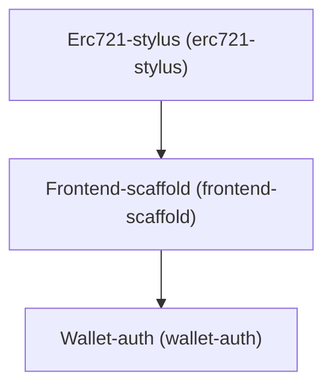

# Architecture

## Dependency Graph

```mermaid
graph TD
  83cd222f["Erc721-stylus (erc721-stylus)"]
  86911802["Frontend-scaffold (frontend-scaffold)"]
  dcdeca29["Wallet-auth (wallet-auth)"]
  83cd222f --> 86911802
  86911802 --> dcdeca29
```

## Execution / Implementation Order

1. **Erc721-stylus** (`83cd222f`)
2. **Frontend-scaffold** (`86911802`)
3. **Wallet-auth** (`dcdeca29`)
